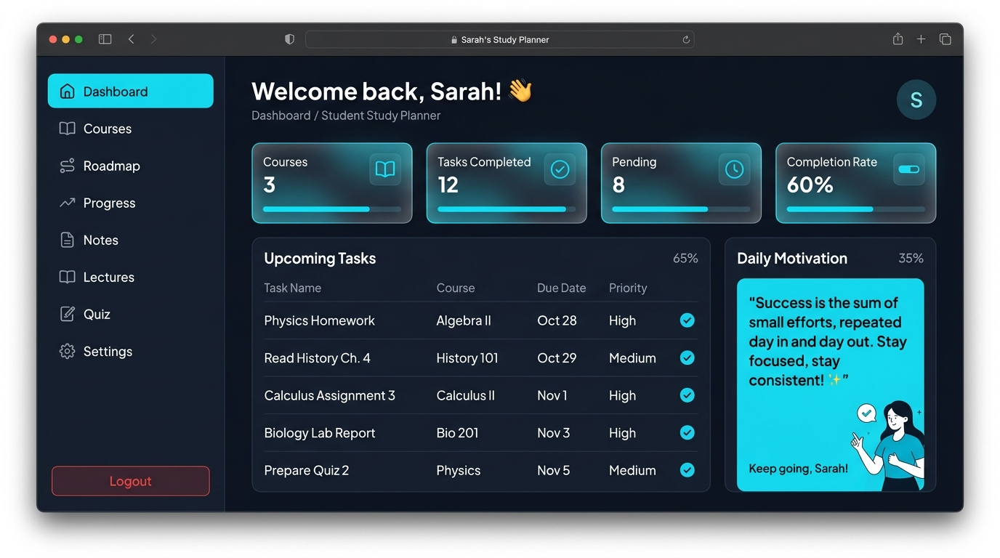

# Student Study Planner 📚

**Plan smarter. Study better.**

An AI-powered student study planner that turns syllabus chaos into a structured 15-week roadmap. Upload your course outline, set your free time, and get a personalized schedule with progress tracking, quizzes, notes, and more.

<p align="center">
  
</p>

---

## Screenshots

### Dashboard
Track courses, tasks, completion rate, and upcoming work at a glance.

<p align="center">
  
</p>

---

## How It Works

Student Study Planner follows a simple three-step flow:

```
Upload Syllabus  →  Set Your Schedule  →  Follow Your Roadmap
     (PDF/Image)       (Free time & breaks)     (Tasks & progress)
```

### 1. Add your courses
Go to **Courses** and create a course by name. Upload a PDF or image of your syllabus — the app uses **pdfjs-dist** for text extraction and **Tesseract.js OCR** for scanned documents. Weekly topics (up to 15 weeks) are parsed automatically. You can also type or edit topics manually.

### 2. Configure your availability
On the **Roadmap** page, set:
- Daily study hours and which days you're available
- Start/end times and break intervals
- Which courses to include in the plan

The scheduler distributes syllabus content across your free slots and generates daily tasks with due dates and time blocks.

### 3. Study and track progress
Use the **Dashboard** and **Progress** pages to see completed, pending, and overdue tasks. Mark tasks done as you go. Switch between **list, calendar, timetable, chart, and flowchart** views on the Roadmap.

### 4. Extra tools
- **Quiz** — Generate MCQ, short-answer, and long-answer practice questions from course content
- **Notes** — Keep per-course notes organized in one place
- **Lectures** — Save and manage lecture links per course
- **Settings** — Profile, theme (light/dark/system), and account options

---

## Features

| Feature | Description |
|---|---|
| 📄 Syllabus parser | Upload PDFs or images; OCR extracts weekly topics automatically |
| 🗓️ Smart roadmap | Builds a personalized 15-week study plan from your syllabus |
| ✅ Task tracking | Completed, pending, and overdue tasks with due dates |
| 📊 Progress views | Charts and stats to visualize your semester |
| 🧠 Quiz generator | Practice quizzes from your course material |
| 📝 Notes & lectures | Organize notes and lecture links per course |
| 🔐 Authentication | Secure JWT login, register, and password reset |
| ☁️ Cloud sync | Data stored in Neon PostgreSQL via Vercel serverless API |

---

## Tech Stack

| Layer | Technology |
|---|---|
| Frontend | React 18, TypeScript, Vite |
| UI | Tailwind CSS, shadcn/ui, Lucide icons |
| State | Zustand (localStorage + database sync) |
| Backend | Vercel Serverless Functions |
| Database | Neon PostgreSQL |
| ORM | Drizzle ORM |
| Auth | JWT + bcrypt |
| PDF / OCR | pdfjs-dist, Tesseract.js |

---

## Project Structure

```
Planner/
├── api/                      # Vercel serverless API routes
│   ├── _lib/                 # DB connection, schema, auth helpers
│   ├── auth/                 # register, login, forgot/reset password
│   ├── courses/              # Course CRUD
│   └── tasks/                # Task CRUD
├── src/
│   ├── pages/                # Landing, Dashboard, Courses, Roadmap, Quiz, etc.
│   ├── components/           # UI and layout components
│   └── lib/
│       ├── api.ts            # Frontend API client
│       ├── store.ts          # Zustand store (syncs to DB when logged in)
│       └── syllabusParser.ts # PDF/image syllabus parser
├── public/                   # Static assets & screenshots
├── vercel.json               # Vercel routing
└── drizzle.config.ts         # Drizzle ORM config
```

---

## Getting Started

### Prerequisites
- Node.js 18+
- A free [Neon](https://neon.tech) PostgreSQL database

### Setup

1. **Clone the repository**
   ```bash
   git clone https://github.com/your-username/student-study-planner.git
   cd student-study-planner/Planner
   ```

2. **Install dependencies**
   ```bash
   npm install
   ```

3. **Configure environment variables** — copy `.env.example` to `.env`:
   ```env
   DATABASE_URL=postgresql://your-neon-connection-string
   JWT_SECRET=your-long-random-secret
   RESEND_API_KEY=your-resend-key   # optional, for password reset emails
   ```

4. **Push the database schema**
   ```bash
   npm run db:push
   ```

5. **Run locally**
   ```bash
   # Frontend + API together (recommended):
   npx vercel dev

   # Or frontend only:
   npm run dev

   # Or local Express server + frontend:
   npm run dev:full
   ```

   Open [http://localhost:8080](http://localhost:8080).

---

## Deployment (Vercel)

1. Push the repo to GitHub
2. Import on [vercel.com](https://vercel.com) — set **Root Directory** to `Planner`
3. Add environment variables: `DATABASE_URL`, `JWT_SECRET`, and optionally `RESEND_API_KEY`
4. Deploy

---

## Database Commands

```bash
npm run db:push      # Push schema to Neon
npm run db:studio    # Open Drizzle Studio
npm run db:generate  # Generate migration files
```

---

## Author

**Muhammad Ayan Anwer**

- Email: muhammadayananwer5@gmail.com
- Phone: +92 345 2284536

For collaboration or feedback, feel free to reach out!

---

## License

This project is open source. Feel free to fork, use, and improve it.
"# Study-Planner" 
